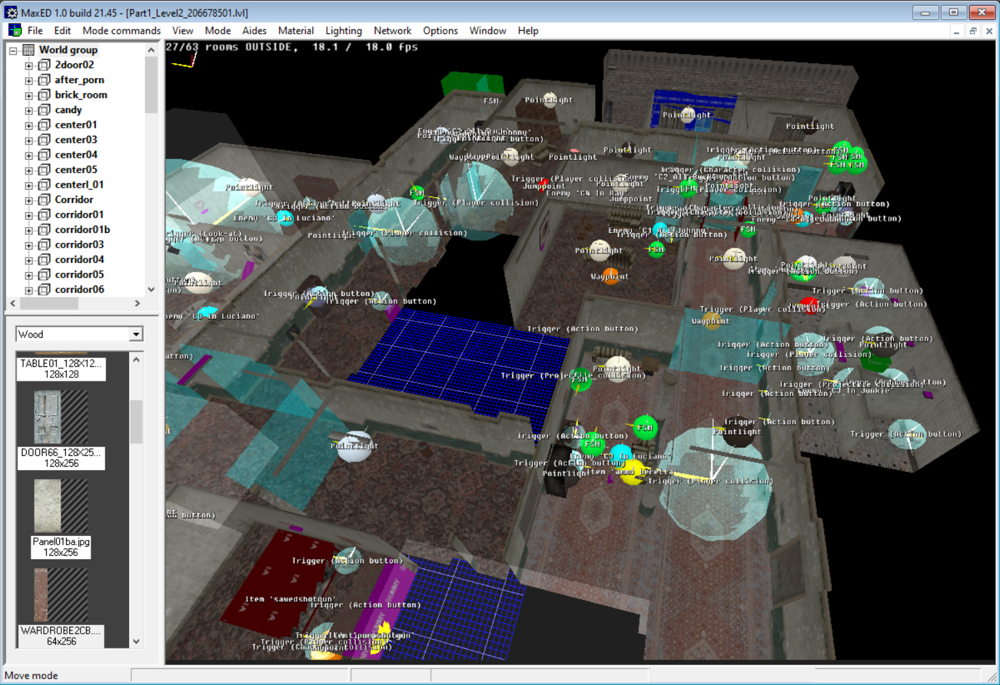
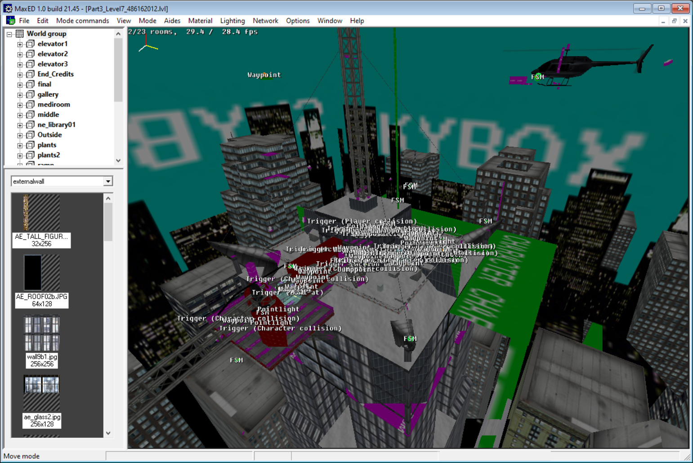
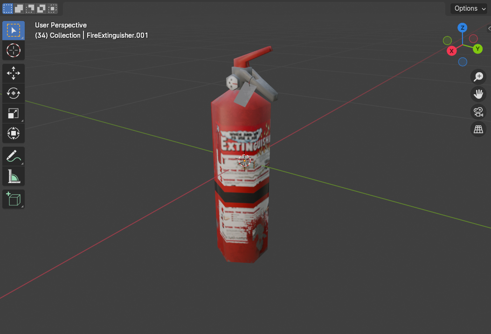
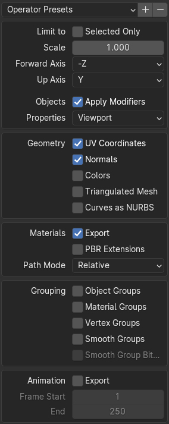
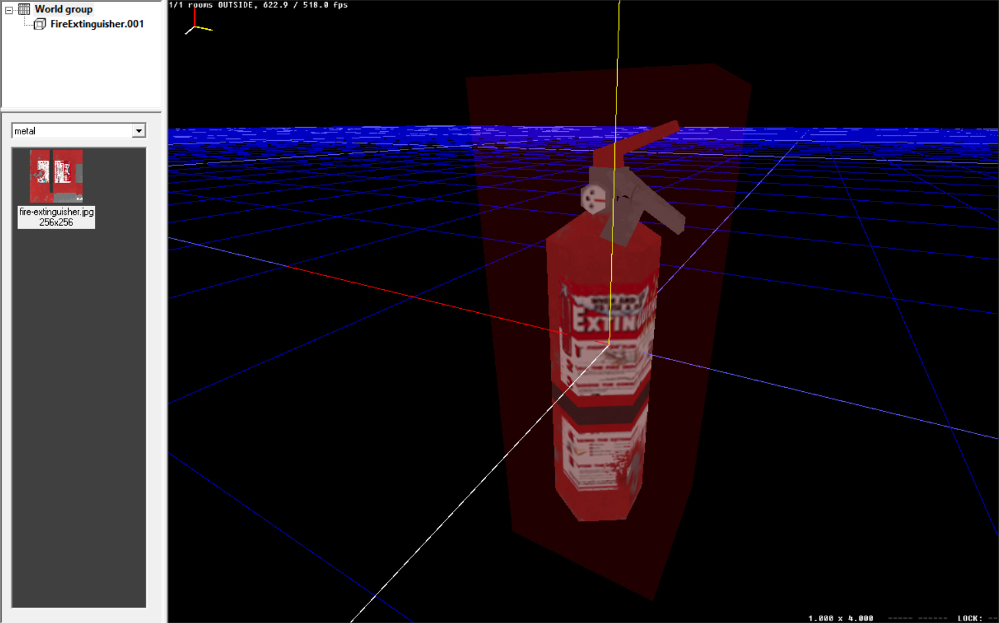

# Max Payne 1 LDB to MaxED LVL converter

### [Download JAR](https://github.com/artkuznet/ldb-to-lvl/raw/refs/heads/dev/docs/ldb-to-lvl.jar)

Java 8 or more recent is required

### How to use:
Specify one or more paths to ldb files as arguments
```
java -jar ldb-to-lvl.jar "C:\Program Files (x86)\MAX-FX Tools\MaxEd\Examples\BasicRoom.ldb"
```

Coplanar polygons will be joined by default.
To avoid joining them, use the `--skip-join-polygons` option.

```
java -Xmx1024m -jar ldb-to-lvl.jar Part3_Level5.ldb Part3_Level5b.ldb --skip-join-polygons
```

The .lvl files will be created in the same directory where the .ldb files are located.



### Wavefront OBJ to LVL feature:
This is an example of using the converter with Blender. Prepare a low poly model.
Use a texture format supported by MaxEd.
**JPG** or **TGA** 24 bits/pixel without RLE are preferred.


Export as Wavefront (.obj), select `Relative` or `Absolute` materials path mode.
For more accurate UV textures select `Triangulated Mesh` and then use the `--skip-join-polygons` option.



```
java -jar ldb-to-lvl.jar FireExtinguisher.obj
```


### OBJ examples:

* [CardboardBox](https://github.com/artkuznet/ldb-to-lvl/raw/refs/heads/dev/docs/example/CardboardBox.zip)
* [FireExtinguisher](https://github.com/artkuznet/ldb-to-lvl/raw/refs/heads/dev/docs/example/FireExtinguisher.zip)
* [Objects](https://github.com/artkuznet/ldb-to-lvl/raw/refs/heads/dev/docs/example/Objects.zip)

See also [Max Payne 1 and Max Payne 2 LDB Importer plugin for Maya](https://github.com/m0nstr0/max_payne_ldb_importer) by [m0nstr0](https://github.com/m0nstr0)
